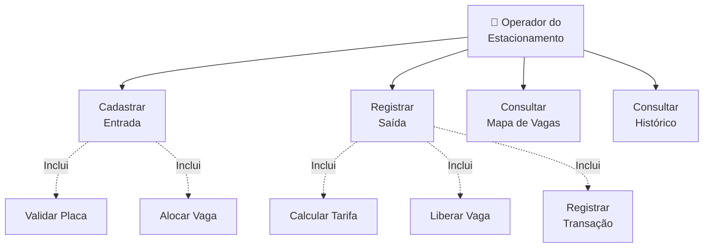
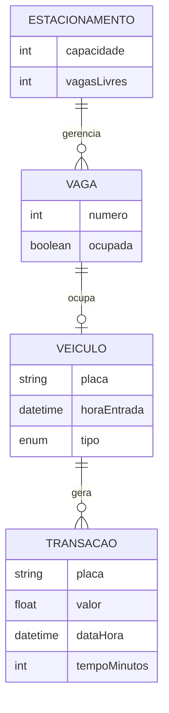

# Análise orientada a objeto

> Nota Importante: A **análise orientada a objeto** descreve o problema a ser resolvido, identifica os atores envolvidos, levanta os requisitos funcionais e define os principais conceitos do domínio antes de passarmos para a etapa de projeto.

## Descrição Geral do Domínio

O sistema proposto gerencia um **estacionamento comercial em tempo real**. O operador do estacionamento precisa controlar a **entrada** e a **saída** de veículos, especificamente **carros** e **motos**, visualizando instantaneamente quais vagas estão livres ou ocupadas.

Quando um veículo entra, o sistema registra sua placa e tipo, encontra automaticamente a primeira vaga compatível disponível e atualiza o mapa visual. Quando o veículo sai, o operador informa a placa, o sistema localiza onde ele está, calcula automaticamente o valor da estadia considerando o tempo de permanência e aplica a tarifa específica para aquele tipo de veículo utilizando polimorfismo.

## Requisitos Funcionais

1. **Registrar entrada** com placa e tipo de veículo
2. **Alocar automaticamente** a primeira vaga compatível
3. **Registrar saída** buscando o veículo pela placa
4. **Calcular tarifa** com valores diferenciados (carro ≠ moto)
5. **Exibir mapa visual** de vagas atualizado em tempo real
6. **Manter histórico** de transações financeiras

## Requisitos Não-Funcionais

| Critério | Detalhe |
|----------|---------|
| **Performance** | Busca de veículos deve ser instantânea (O(1)) |
| **Usabilidade** | Interface simples com mapa visual intuitivo |
| **Confiabilidade** | Validar duplicatas, estacionamento lotado, veículos inexistentes |
| **Manutenibilidade** | Separação clara de responsabilidades entre classes |

---

## Ator Principal

**Operador do Estacionamento** — Registra entradas/saídas, consulta vagas e cobra clientes.

## Casos de Uso Principais

### UC1: Cadastrar Entrada
**Objetivo:** Registrar a chegada de um veículo

| Passo | Descrição |
|-------|-----------|
| 1 | Operador informa placa e tipo (Carro/Moto) |
| 2 | Sistema valida se placa não está duplicada |
| 3 | Sistema procura primeira vaga livre |
| 4 | Sistema aloca veículo na vaga |
| 5 | Mapa visual é atualizado |

**Exceções:** Estacionamento lotado | Veículo já estacionado

### UC2: Registrar Saída
**Objetivo:** Registrar saída e calcular cobrança

| Passo | Descrição |
|-------|-----------|
| 1 | Operador informa placa |
| 2 | Sistema localiza veículo (busca O(1)) |
| 3 | Sistema calcula tempo de permanência |
| 4 | **Polimorfismo:** Calcula tarifa conforme tipo |
| 5 | Sistema libera vaga |
| 6 | Registra transação (placa, valor, data/hora) |
| 7 | Mapa visual é atualizado |

**Exceção:** Veículo não encontrado

### UC3: Consultar Mapa de Vagas
**Objetivo:** Visualizar estado atual do estacionamento

Exibe grade com vagas em verde (livres) e vermelho (ocupadas), atualizada em tempo real.

---

## Diagrama de Casos de Uso

## Modelo Conceitual

## Classes Identificadas

| Classe | Responsabilidade |
|--------|------------------|
| **Veiculo** (abstrata) | Define interface para cálculo de tarifa |
| **Carro** | Especialização com tarifa própria |
| **Moto** | Especialização com tarifa própria |
| **Vaga** | Gerencia estado (livre/ocupada) |
| **Estacionamento** | Coordena entradas, saídas, buscas e histórico |
| **Transacao** | Registra cobranças (placa, valor, data/hora) |

---

[Retroceder](README.md) | [Avançar](projeto.md)

