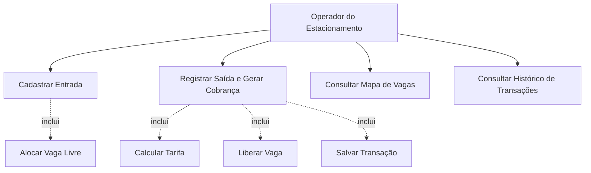
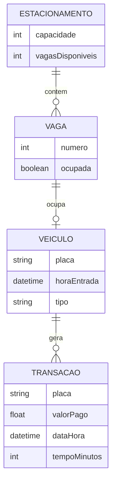

# Análise orientada a objeto

> Nota Importante: A **análise orientada a objeto** descreve o problema a ser resolvido, identifica os atores envolvidos, levanta os requisitos funcionais e define os principais conceitos do domínio antes de passarmos para a etapa de projeto.

## Descrição Geral do Domínio

O sistema proposto gerencia um **estacionamento comercial em tempo real**. O operador do estacionamento precisa controlar a **entrada** e a **saída** de veículos, especificamente **carros** e **motos**, visualizando instantaneamente quais vagas estão livres ou ocupadas.

Quando um veículo entra, o sistema registra sua placa e tipo, encontra automaticamente a primeira vaga compatível disponível e atualiza o mapa visual. Quando o veículo sai, o operador informa a placa, o sistema localiza onde ele está, calcula automaticamente o valor da estadia considerando o tempo de permanência e aplica a tarifa específica para aquele tipo de veículo utilizando polimorfismo.

## Requisitos Funcionais

1. **Registrar entrada de veículos** informando placa e tipo: Carro ou Moto.
2. **Alocar automaticamente** o veículo na primeira vaga livre correspondente ao seu tamanho/tipo.
3. **Registrar saída do veículo** buscando-o pela placa.
4. **Calcular automaticamente o valor da estadia** com tarifas diferentes para carros e motos, aplicando polimorfismo.
5. **Exibir um painel visual**, ou mapa de vagas, atualizado em tempo real.
6. **Registrar transações financeiras** de saída, contendo placa, valor pago, data/hora e tempo de permanência.

## Requisitos Não Funcionais

- **Performance:** a busca de veículos pela placa deve ser rápida, preferencialmente em tempo médio O(1).
- **Usabilidade:** a interface deve ser simples, com formulário de placa/tipo e mapa visual colorido das vagas.
- **Confiabilidade:** o sistema deve impedir entradas duplicadas, tratar estacionamento lotado e informar placas não encontradas.
- **Manutenibilidade:** a modelagem deve deixar clara a separação de responsabilidades entre as diferentes classes como Veiculo, Vaga, Estacionamento e Transacao.
- **Escalabilidade inicial:** o estacionamento deve suportar uma quantidade configurável de vagas, por exemplo 50 vagas.

## Ator Principal

### Operador do Estacionamento

Pessoa responsável por operar o sistema durante o expediente, registrando entradas, saídas, cobranças e consultando o mapa de vagas.

## Casos de Uso Principais

### 1. Cadastrar Entrada

**Ator:** Operador do Estacionamento  
**Objetivo:** Registrar a chegada de um carro ou moto no estacionamento  
**Fluxo principal:**

1. O operador informa a placa do veículo.
2. O operador seleciona o tipo do veículo: Carro ou Moto.
3. O sistema verifica se a placa já está estacionada.
4. O sistema procura a primeira vaga livre correspondente.
5. O sistema cria o objeto Carro ou Moto.
6. O sistema aloca o veículo na vaga.
7. O mapa visual de vagas é atualizado.

**Fluxos alternativos:**

- Se não houver vaga livre, o sistema exibe a mensagem "Estacionamento lotado".
- Se a placa já estiver cadastrada, o sistema exibe a mensagem "Veículo já estacionado".

### 2. Registrar Saída

**Ator:** Operador do Estacionamento  
**Objetivo:** Registrar a saída do veículo e calcular o valor a ser cobrado  
**Fluxo principal:**

1. O operador informa a placa do veículo.
2. O sistema busca a placa no controle interno.
3. O sistema identifica a vaga ocupada pelo veículo.
4. O sistema calcula o tempo de permanência.
5. O sistema chama calcularTarifa() usando polimorfismo.
6. O sistema libera a vaga.
7. O sistema registra uma Transacao com placa, valor pago e data/hora.
8. O sistema retorna o valor devido para o operador.
9. O mapa visual de vagas é atualizado.

**Fluxo alternativo:**

- Se a placa não for encontrada, o sistema exibe a mensagem **Veículo não encontrado**.

### 3. Consultar Mapa de Vagas

**Ator:** Operador do Estacionamento  
**Objetivo:** Visualizar em tempo real o estado das vagas do estacionamento  
**Fluxo principal:**

1. O operador acessa a tela principal.
2. O sistema exibe todas as vagas em formato de grade.
3. Vagas livres aparecem em verde.
4. Vagas ocupadas aparecem em vermelho.
5. O painel é atualizado após cada entrada ou saída.

## Diagrama de Casos de Uso

## Modelo Conceitual do Domínio

## Principais Classes Identificadas

- **Veiculo:** entidade abstrata que representa qualquer veículo estacionado.
- **Carro:** especialização de Veiculo com tarifa própria.
- **Moto:** especialização de Veiculo com tarifa própria.
- **Vaga:** representa uma vaga física do estacionamento.
- **Estacionamento:** controla vagas, entradas, saídas, buscas e histórico.
- **Transacao:** registra a cobrança realizada na saída de um veículo.

[Retroceder](README.md) | [Avançar](projeto.md)

