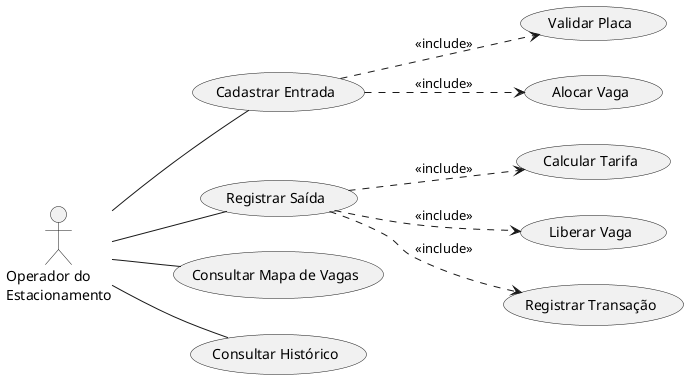
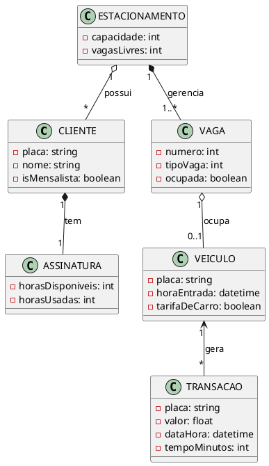

# Análise orientada a objeto

> Nota Importante: A **análise orientada a objeto** descreve o problema a ser resolvido, identifica os atores envolvidos, levanta os requisitos funcionais e define os principais conceitos do domínio antes de passarmos para a etapa de projeto.

## Descrição Geral do Domínio

O sistema proposto gerencia um **estacionamento comercial em tempo real** com capacidade para 80 vagas segregadas: **50 vagas para carros** e **30 vagas para motos**. O operador do estacionamento precisa controlar a **entrada** e a **saída** de veículos, visualizando instantaneamente quais vagas de cada tipo estão livres ou ocupadas.

Quando um veículo entra, o sistema registra sua placa e tipo, encontra automaticamente a primeira vaga compatível disponível e atualiza o mapa visual. O sistema aplica um modelo de **fallback inteligente**: se as vagas de motos esgotarem, uma moto poderá ocupar uma vaga de carro, porém o sistema registrará a aplicação da tarifa de carro (R$ 5,00/h). Quando o veículo sai, o operador informa a placa, o sistema localiza a vaga, calcula o tempo e cobra a tarifa aplicando **polimorfismo** de acordo com o tipo e a regra de fallback registrada.

## Requisitos Funcionais

1. **Registrar entrada** com placa e tipo de veículo
2. **Alocar automaticamente** a primeira vaga compatível (aplicando fallback de moto para vaga de carro, se necessário)
3. **Registrar saída** buscando o veículo pela placa
4. **Calcular tarifa polimórfica** (Motos em vagas de carro herdam tarifa de carro automaticamente)
5. **Suporte a Clientes Mensalistas**: Abatimento de horas através de banco de horas (assinatura) em vez de cobrança avulsa.
5. **Exibir mapa visual** de vagas atualizado em tempo real
6. **Manter histórico** de transações financeiras

## Requisitos Não-Funcionais

| Critério | Detalhe |
|----------|---------|
| **Performance** | Busca de veículos deve ser instantânea (O(1)) |
| **Usabilidade** | Interface simples com mapa visual intuitivo |
| **Confiabilidade** | Validar duplicatas, estacionamento lotado, veículos inexistentes |
| **Manutenibilidade** | Separação clara de responsabilidades entre classes |

---

## Atores Principais

1. **Operador do Estacionamento** — Registra entradas/saídas, consulta vagas e cobra clientes.
2. **Cliente Mensalista** — Possui um plano de assinatura em horas e utiliza o estacionamento abatendo do seu saldo.

## Casos de Uso Principais

### UC1: Cadastrar Entrada
**Objetivo:** Registrar a chegada de um veículo

| Passo | Descrição |
|-------|-----------|
| 1 | Operador informa placa e tipo (Carro/Moto) |
| 2 | Sistema valida se placa não está duplicada |
| 3 | Sistema procura vaga livre compatível (Strategy Pattern) |
| 4 | Sistema aloca veículo (Se moto ocupar vaga de carro, recebe flag de *fallback*) |
| 5 | Mapa visual é atualizado (separando visualmente Carros e Motos) |

**Exceções:** Estacionamento lotado para o tipo | Veículo já estacionado

### UC2: Registrar Saída
**Objetivo:** Registrar saída e calcular cobrança

| Passo | Descrição |
|-------|-----------|
| 1 | Operador informa placa |
| 2 | Sistema localiza veículo (busca O(1)) |
| 3 | Sistema calcula tempo de permanência |
| 4 | **Polimorfismo:** Calcula tarifa conforme tipo ou **Assinatura** |
| 5 | Sistema libera vaga |
| 6 | Registra transação (placa, valor cobrado ou horas abatidas, data/hora) |
| 7 | Mapa visual é atualizado |

**Exceção:** Veículo não encontrado | Mensalista sem saldo de horas (cobra excedente)

### UC3: Consultar Mapa de Vagas
**Objetivo:** Visualizar estado atual do estacionamento

Exibe grade com vagas em verde (livres) e vermelho (ocupadas), atualizada em tempo real.

---

## Diagrama de Casos de Uso

## Modelo Conceitual

## Classes Identificadas

| Classe | Responsabilidade |
|--------|------------------|
| **Veiculo** (abstrata) | Define interface genérica de tarifação e polimorfismo |
| **Carro** / **Moto** | Especializações com tarifas próprias e regra de *fallback* |
| **EstrategiaAlocacao** | Define regra intercambiável para busca de vagas e fallbacks |
| **TarifaVeiculo** | Interface abstrata para definir a forma de cobrança (Comum ou Mensalista) |
| **Cliente** | Armazena dados de negócio (nome, placa, isMensalista) independente do veículo |
| **Assinatura** | Mantém o estado do banco de horas do Cliente |
| **Vaga** | Gerencia estado (livre/ocupada) e restrição de tipo (Carro/Moto) |
| **Estacionamento** | Coordena fluxo (80 vagas divididas), aplica estratégias e gerencia clientes |
| **Transacao** | Registra cobranças (placa, valor, data/hora) |

---

[Retroceder](README.md) | [Avançar](projeto.md)

