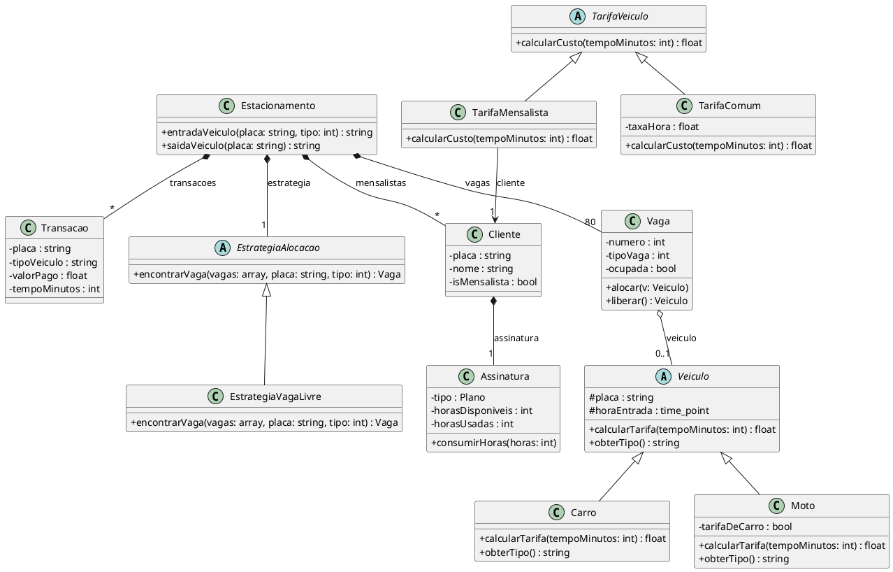

# Arquivos do Projeto

Para facilitar o entendimento, aqui explicamos qual é a responsabilidade de cada arquivo dentro do nosso código:

## 🚗 Veículos
- **Veiculo.h / .cpp**: Guarda informações comuns, como a placa e o horário exato que o veículo entrou.
- **Carro.h / .cpp**: Regras específicas para carros. Ensina o sistema a calcular o preço da estadia de um carro.
- **Moto.h / .cpp**: Regras específicas para motos. Ensina o sistema a calcular o preço da estadia de uma moto.

## 🅿️ Controle do Estacionamento
- **Estacionamento.h / .cpp**: Registra as entradas e saídas, gerencia todas as vagas e conecta as outras partes do código.
- **Vaga.h**: Sabe o tipo da vaga, se ela está ocupada ou livre, e qual veículo está parado nela.
- **EstrategiaAlocacao.h / .cpp**: Define as regras de como o sistema deve procurar uma vaga livre para colocar um carro ou moto que acabou de chegar.

## 👥 Mensalistas e Assinaturas
- **Cliente.h / .cpp**: Cadastra uma pessoa no sistema. Guarda o nome, a placa e se ela tem um plano mensal.
- **Assinatura.h / .cpp**: Gerencia o banco de horas de um cliente mensalista. Controla qual é o plano dele, quantas horas ele tem direito e quantas já gastou no mês.

## 💰 Cobrança e Histórico
- **TarifaVeiculo.h / .cpp**: Separa a cobrança de um cliente comum (que paga em dinheiro) da cobrança de um cliente mensalista (que desconta das horas da assinatura).
- **Transacao.h / .cpp**: Guarda o que aconteceu (placa, data, hora e valor pago).

## 🖥️ Interface Gráfica e Inicialização
- **MainWindow.h / .cpp**: Cuida do visual (telas, botões, mapa das vagas, menus).
- **main.cpp**: Inicia o sistema.

## 📊 Diagrama de Classes

De acordo com as boas práticas das aulas de UML (composição, agregação, herança e dependência), segue o Diagrama de Classes principal do projeto:

