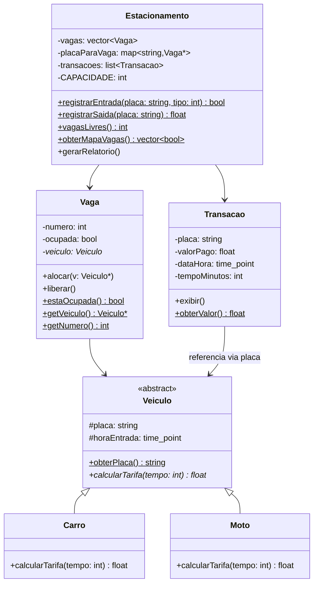
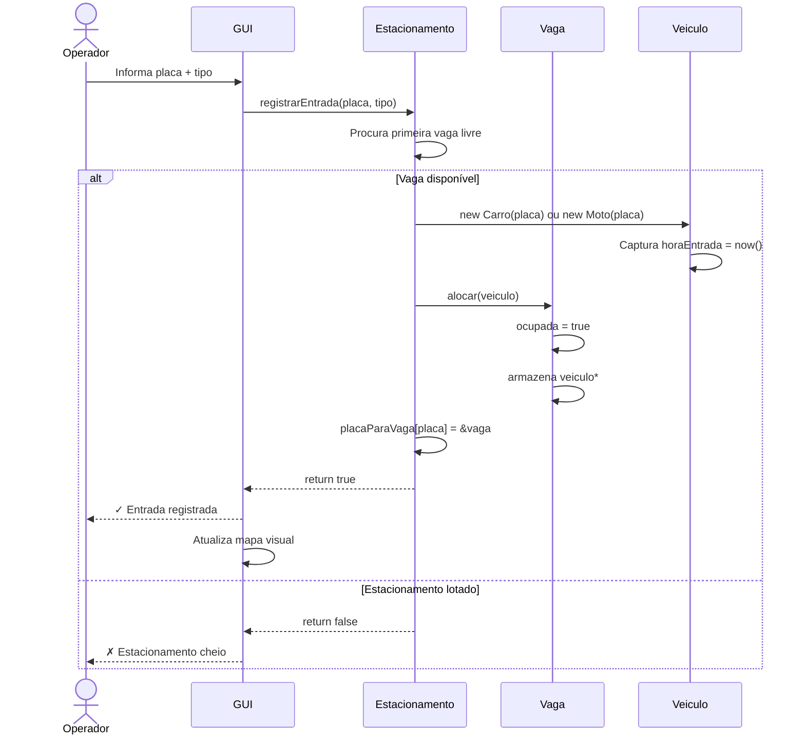
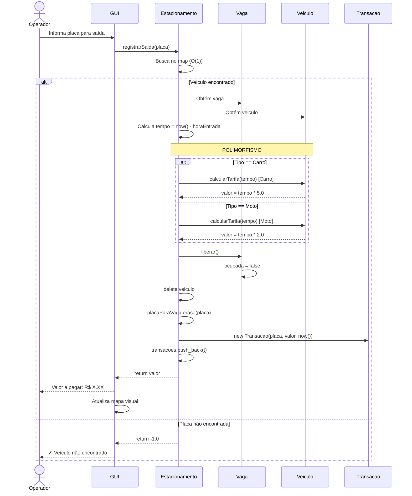

# Projeto orientado a objeto

> O projeto apresenta a solução em **UML**, transformando os conceitos da análise em uma **arquitetura concreta** de software com classes, relacionamentos e interações.

---

## Diagrama de Classes UML



## Descrição das Classes

| Classe | Tipo | Responsabilidade |
|--------|------|------------------|
| **Veiculo** | Abstrata | Define contrato para cálculo de tarifa (polimorfismo) |
| **Carro** | Concreta | Implementa tarifa: R$ 5.00/hora |
| **Moto** | Concreta | Implementa tarifa: R$ 2.00/hora |
| **Vaga** | Concreta | Gerencia estado (livre/ocupada) e armazena veículo |
| **Estacionamento** | Concreta | Coordena entradas, saídas e mantém estruturas de dados |
| **Transacao** | Concreta | Registra cobrança com placa, valor, data/hora |

---

## Diagramas de Sequência

### Sequência 1: Registrar Entrada



**Fluxo:** Operador → GUI → Estacionamento busca vaga → Aloca veículo → Sincroniza mapa → Retorna sucesso

### Sequência 2: Registrar Saída



**Fluxo:** Operador → Busca (O(1)) → Calcula com polimorfismo → Libera vaga → Registra transação → Retorna valor

---

##  Padrões de Design Utilizados

### 1. Polimorfismo
A classe abstrata `Veiculo` define o contrato `calcularTarifa()`, e cada subclasse implementa sua própria lógica. Sem if-else!

### 2. Estratégia de Cálculo
Diferentes "estratégias" de tarifa para Carro e Moto, selecionadas em tempo de execução.

### 3. Abstração
`Estacionamento` encapsula toda a complexidade (vagas, mapa de busca, histórico) oferecendo uma interface simples ao operador.

### 4. GUI
A GUI observa mudanças no `Estacionamento` e atualiza o mapa automaticamente após cada operação.

---

## 📊 Principais Métodos

| Método | Classe | Complexidade | Descrição |
|--------|--------|--------------|-----------|
| `registrarEntrada()` | Estacionamento | O(n) | Busca vaga linear, aloca, sincroniza mapa |
| `registrarSaida()` | Estacionamento | O(1) | Busca hash instantânea, calcula tarifa, libera |
| `calcularTarifa()` | Carro/Moto | O(1) | Polimorfismo: horas × taxa/hora |
| `alocar()/liberar()` | Vaga | O(1) | Gerencia estado |
| `vagasLivres()` | Estacionamento | O(n) | Percorre vetor contando |

---

## 🔗 Relacionamentos

```
Estacionamento [1] ──── [50] Vaga
                        ↓
                    Veiculo (abstrato)
                    ├── Carro
                    └── Moto
                        ↓
                    Transacao [*]
```

**Cardinalidade:**
- Um Estacionamento contém **50 Vagas**
- Uma Vaga pode conter **0 ou 1 Veículo** (livre ou ocupada)
- Um Veículo gera **0 ou N Transações** (histórico de cobranças)

---

<div align=center>

[Retroceder](analise.md) | [Avançar](implementacao.md)

</div>

> Nota Importante: O **Projeto orientado a objeto** é composto pela documentação do projeto descrita em UML. Deve incluir um Diagrama de Classes do sistema projetado e pelo menos um diagrama de sequência mostrando a interação entre os componentes em um dos casos de uso. Outros diagramas podem ser incluídos conforme necessário para melhor comunicar a solução.
