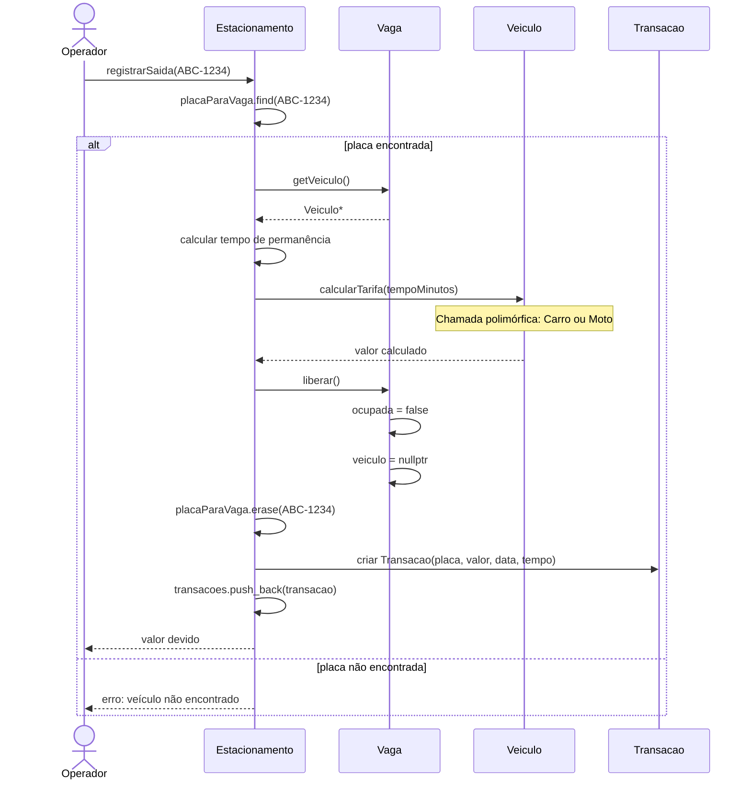
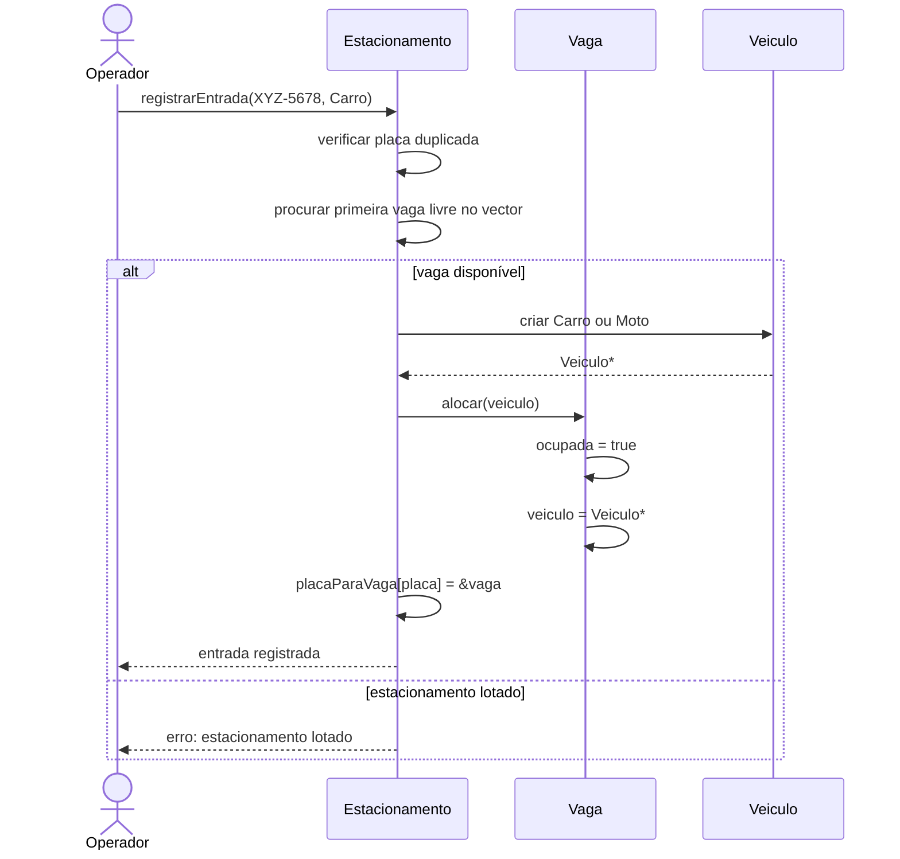

# Projeto orientado a objeto

> Nota Importante: O **projeto orientado a objeto** apresenta a solução em UML, detalhando as classes, seus relacionamentos e as interações entre os objetos. Nesta etapa, os conceitos identificados durante a análise são transformados em uma estrutura concreta de software.

## Diagrama de Classes UML

A estrutura é construída utilizando herança e polimorfismo para oferecer diferentes cálculos de tarifa conforme o tipo de veículo. A classe Estacionamento gerencia o conjunto de vagas e mantém estruturas de dados para permitir buscas rápidas e rastreamento do histórico financeiro.

```mermaid
classDiagram
    class Veiculo {
        <<abstract>>
        #placa: string
        #horaEntrada: time_point
        +Veiculo(placa: string)
        +getPlaca() string
        +getHoraEntrada() time_point
        +calcularTarifa(tempoMinutos: int) float*
    }

    class Carro {
        +Carro(placa: string)
        +calcularTarifa(tempoMinutos: int) float
    }

    class Moto {
        +Moto(placa: string)
        +calcularTarifa(tempoMinutos: int) float
    }

    class Vaga {
        -numero: int
        -ocupada: bool
        -veiculo: Veiculo*
        +Vaga(numero: int)
        +alocar(veiculo: Veiculo*) void
        +liberar() void
        +estaOcupada() bool
        +getVeiculo() Veiculo*
        +getNumero() int
    }

    class Estacionamento {
        -vagas: vector~Vaga~
        -placaParaVaga: unordered_map~string, Vaga*~
        -transacoes: list~Transacao~
        -capacidade: int
        +Estacionamento(capacidade: int)
        +registrarEntrada(placa: string, tipo: TipoVeiculo) bool
        +registrarSaida(placa: string) float
        +obterMapaVagas() vector~bool~
        +vagasLivres() int
        +gerarRelatorioTransacoes() void
    }

    class Transacao {
        -placa: string
        -valorPago: float
        -dataHora: time_point
        -tempoMinutos: int
        +Transacao(placa: string, valor: float, data: time_point, tempo: int)
        +getRelatorio() string
    }

    Veiculo <|-- Carro
    Veiculo <|-- Moto
    Estacionamento 1 *-- 1..* Vaga : "composicao"
    Vaga 1 --> 0..1 Veiculo : "ponteiro"
    Estacionamento 1 o-- 0..* Transacao : "historico"
```

## Descrição das Classes

### Veiculo
Classe abstrata com os atributos protegidos placa e horaEntrada. Possui o método virtual puro calcularTarifa(tempoMinutos), obrigando cada tipo de veículo a definir sua própria regra de cobrança.

### Carro e Moto
Subclasses concretas de Veiculo. Cada uma sobrescreve calcularTarifa() com valores diferentes, demonstrando o uso de **polimorfismo**.

### Vaga
Representa uma vaga física do estacionamento. Armazena número, estado de ocupação e um ponteiro para o Veiculo atualmente alocado.

### Estacionamento
Classe principal. Faz a composição das vagas por meio de std::vector<Vaga>, controla entrada/saída, usa std::unordered_map<std::string, Vaga*> para localizar veículos por placa e mantém o histórico em std::list<Transacao>.

### Transacao
Objeto criado a cada saída de veículo, contendo placa, valor pago, data/hora e tempo de permanência.

## Diagrama de Sequência — Registrar Saída de Veículo



## Diagrama de Sequência — Cadastrar Entrada de Veículo



<div align=center>

[Retroceder](analise.md) | [Avançar](implementacao.md)

</div>

> Nota Importante: O **Projeto orientado a objeto** é composto pela documentação do projeto descrita em UML. Deve incluir um Diagrama de Classes do sistema projetado e pelo menos um diagrama de sequência mostrando a interação entre os componentes em um dos casos de uso. Outros diagramas podem ser incluídos conforme necessário para melhor comunicar a solução.
